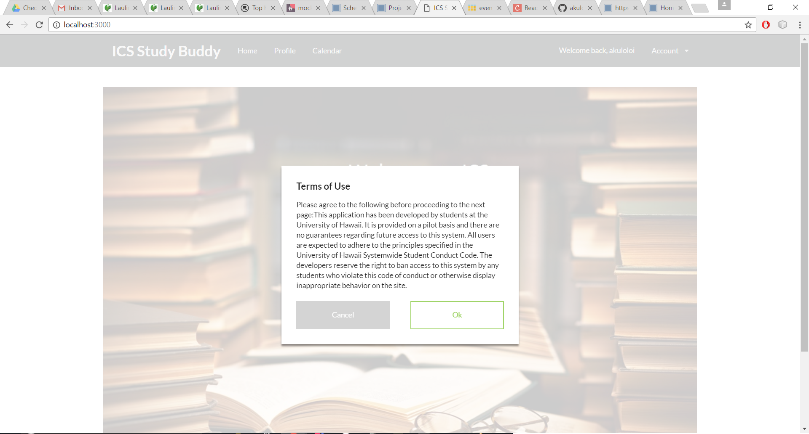
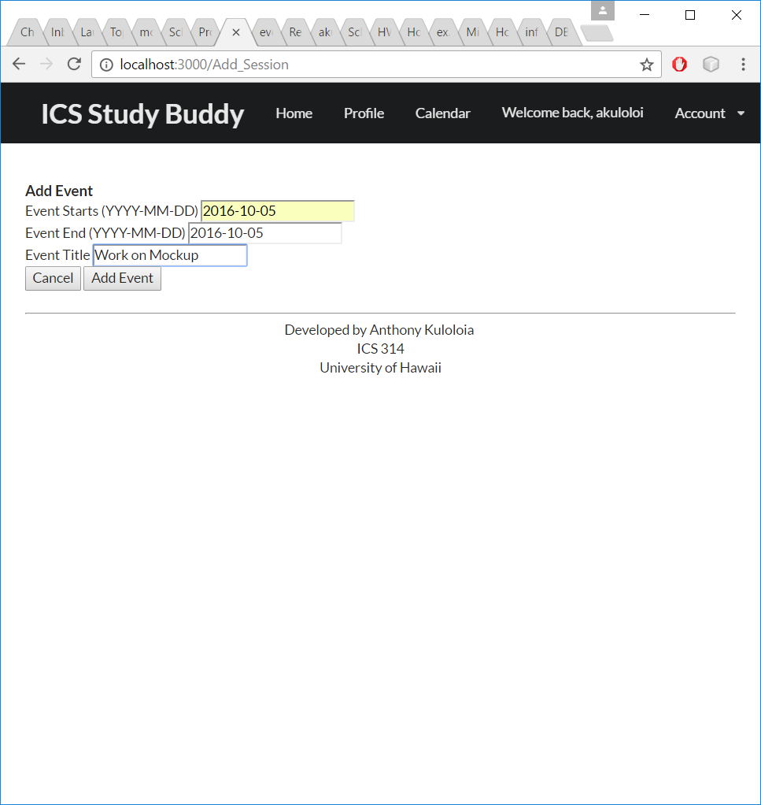
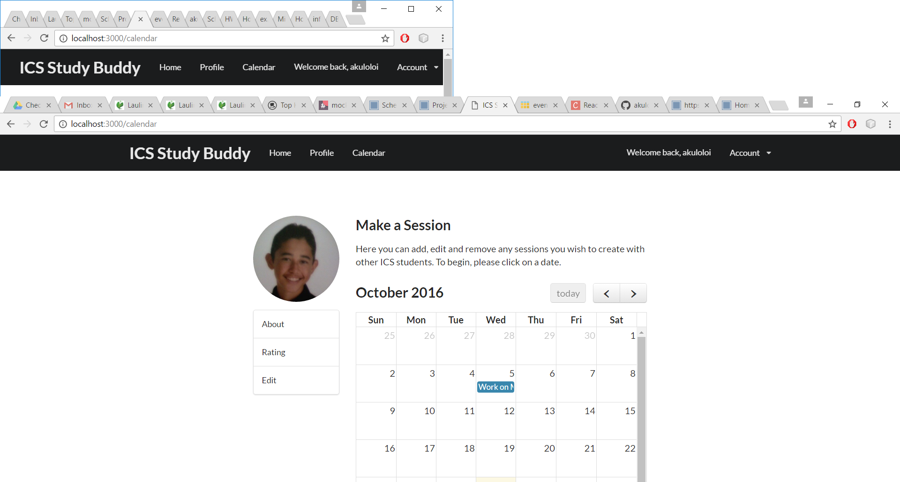

# Public Landing Page

# Agreement Page

# User Home Page

# User Profile Page

# Calendar Page

# Create Session Page

<<<<<<< HEAD

# Calendar After Session is Created

=======
>>>>>>> origin/master
